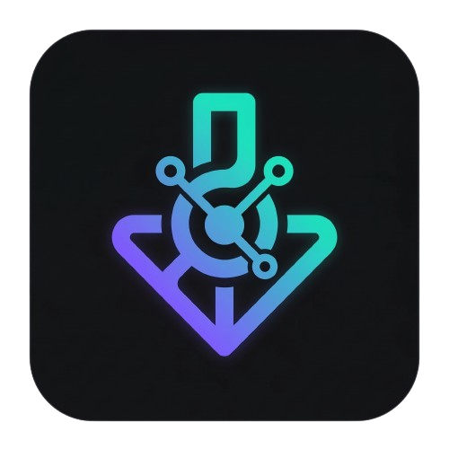

<div align="center">
  
  
  # ServHub
  
  **A fast, modern Linux app store powered by Flathub**
  
  
  
  
  

  
</div>

---

## What is ServHub?

ServHub is a sleek, fast Linux app store that lets you browse, install, and manage Flatpak apps from Flathub — all from a clean, modern interface. Think GNOME Software or KDE Discover, but faster and lighter.

## Features

- Browse hundreds of apps from Flathub
- Install and uninstall Flatpak apps with one click
- Library tab showing all your installed apps
- Live search with instant results
- Categories — Games, Development, Graphics, Office, Science and more
- Fast — server-side caching, lazy image loading, paginated grid
- Clean dark UI built with React + Electron

## Install

### Arch Linux / Manjaro / EndeavourOS / CachyOS

```bash
yay -S servhub
```

### AppImage (any distro)

Download the latest AppImage from [Releases](https://github.com/B5aaR/servhub-store/releases) then:

```bash
chmod +x ServHub-1.0.1.AppImage
./ServHub-1.0.1.AppImage
```

### Quick install script

```bash
curl -fsSL https://raw.githubusercontent.com/B5aaR/servhub-store/main/install.sh | bash
```

## Requirements

- `flatpak` installed on your system
- Flathub remote added:

```bash
flatpak remote-add --if-not-exists flathub https://dl.flathub.org/repo/flathub.flatpakrepo
```

## Build from Source

```bash
git clone https://github.com/B5aaR/servhub-store.git
cd servhub-store

# Install root dependencies
npm install

# Build the frontend
cd frontend
npm install
npm run build
cd ..

# Start ServHub
npm start
```

## Tech Stack

| Layer | Technology |
|---|---|
| Desktop shell | Electron |
| Frontend | React + Vite |
| Backend API | Node.js + Express |
| App source | Flathub API |
| Package manager | Flatpak |

## Contributing

Pull requests are welcome. For major changes please open an issue first.

1. Fork the repo
2. Create a branch `git checkout -b feature/my-feature`
3. Commit your changes `git commit -m "add my feature"`
4. Push `git push origin feature/my-feature`
5. Open a Pull Request

## License

MIT © [B5aaR](https://github.com/B5aaR)

---

<div align="center">
  Made with ❤️ for the Linux community
</div>
